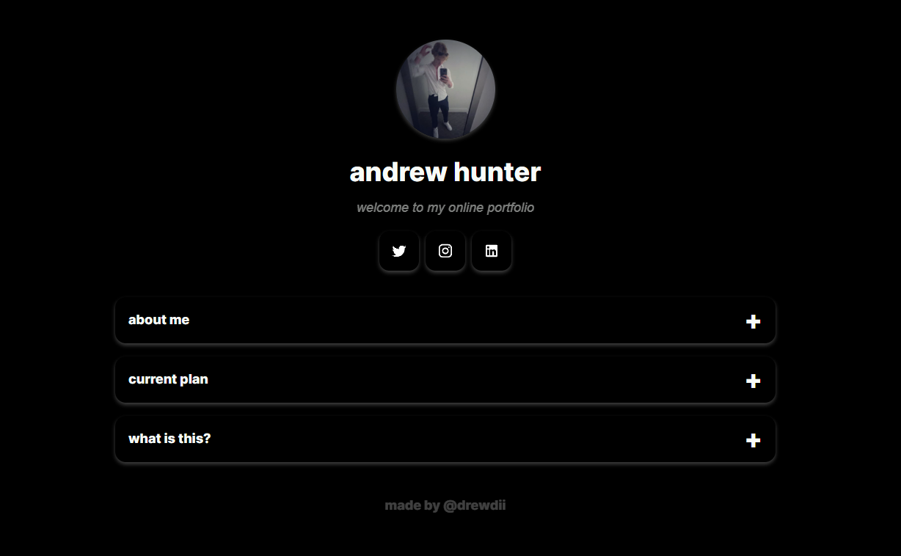

# WELCOME...
> this is my personal portfolio website

 
  <kbd>
    
  </kbd>

---

## WHAT IS THIS?...
Currently, this is my pesonal landing page. The goal is to add a portoflio gallery underneath the information accordion. While this feature is being built, enjoy the simple and effective website I used and host with github pages.

---

## COMPONENT STRUCTURE
Using a modular component structure in web development promotes **_reusabilityy_**, **_maintainability_**, and **_scalability_**.

All components are stacked in the center and can be placed on top or below each other. The current structure is:
1. **profile picture**
2. **name and bio**
3. **link grid**
4. **descirption accordion**

---

### TECHNOLOGIES

#### _HOSTING_:
<!-- github pages -->
 - free website hosting

#### _BUILDING_:
<!-- html badge --> 
 - creating website structure
<!-- css badge --> 
 - basic styling for the project
<!-- javascript badge --> 
 - making components of the project more visual and interactive

---

